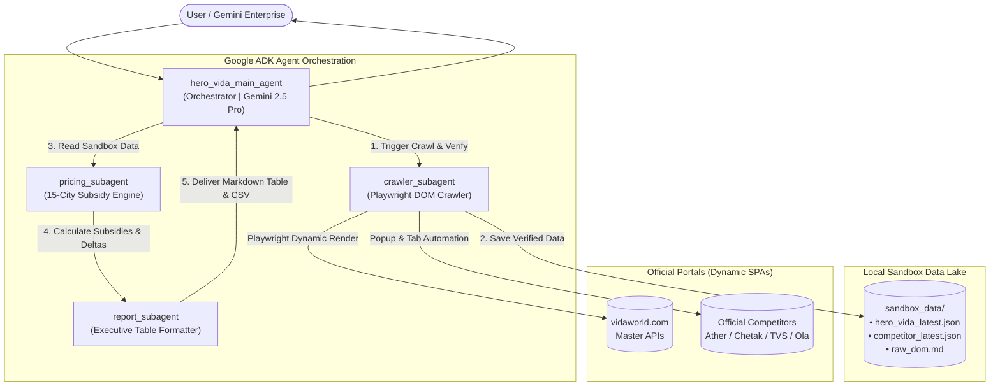

# Hero MotoCorp VIDA — Competitor Intelligence Agent

An enterprise-grade, high-code multi-agent system built with **Google ADK (`google.adk`)** for **Gemini Enterprise** and **Vertex AI Agent Engine**.

---

## 1. Real-Time Dynamic Crawl & Sandbox Architecture

* **Dynamic DOM & SPA Rendering:** Built with **Playwright Headless Chromium** to execute JavaScript, render client-side SPAs (React, Next.js, Vue), and capture full dynamic page state.
* **Automated Popup & Modal Handling:** Dismisses cookie banners, promotional popups, and city/pincode selection overlays automatically.
* **Interactive Variant Tabs & Specs:** Discovers and clicks model variant tabs (e.g. 2.9 kWh vs 3.7 kWh, VX2 Go vs VX2 Plus, S1 X vs S1 Pro) to render and extract dynamic specification tables.
* **Network & API Interception:** Intercepts real-time XHR/Fetch API calls for pricing matrices, variant catalogs, and city discount packages.
* **Dedicated Sandbox Data Store (`sandbox_data/`):** All collected raw DOMs and structured JSON datasets are committed to the local sandbox before passing to the LLM agent pipeline.
* **Strict Official Domain Grounding:** Discovers and verifies official OEM portals (`https://www.vidaworld.com`, `https://www.atherenergy.com`, `https://www.chetak.com`, `https://www.tvsmotor.com`, `https://www.olaelectric.com`), strictly rejecting 3rd-party aggregators and blogs.

---

## 2. Multi-Agent Topology (Google ADK)

```
Hero_competitor_analysis_agent/
├── agent/                         # Main Agent and Sub-Agents
│   ├── agent.py                   # 🌟 MAIN ORCHESTRATOR AGENT (root_agent)
│   ├── sub_agents/                # 🤖 3 SPECIALIZED SUB-AGENTS
│   │   ├── crawler_agent.py       # Sub-Agent 1: Dynamic DOM & Headless Browser Crawler
│   │   ├── pricing_agent.py       # Sub-Agent 2: 15-City PM E-Drive & State Subsidy Calculator
│   │   └── report_agent.py        # Sub-Agent 3: Formats Executive Tables & Visual Badges
│   ├── tools/                     # 🛠️ TOOLS & DATA ENGINES
│   │   ├── web_crawler.py         # Playwright DOM Crawler, Popup/Tab Handler, Cache Engine
│   │   ├── price_engine.py        # PM E-Drive (₹2,500/kWh) & State Subsidy / RTO Calculator
│   │   └── sandbox_manager.py     # Sandbox Data Store manager (JSON & DOM markdown persistence)
├── sandbox_data/                  # 📦 Local Sandbox Data Lake
├── tests/                         # 🧪 Automated Test Suite
│   └── test_agent_and_crawler.py  # Pytest suite for Crawler, Sandbox, and Subsidies
├── main.py                        # Interactive CLI (Chat, Variable Form, Crawler, Sandbox)
├── deploy.sh                      # 🚀 1-Click Deploy to Vertex AI Agent Platform
├── run.sh                         # 1-Click Local Launch script
├── requirements.txt               # Dependencies
└── README.md                      # Documentation
```

---

## 3. Deploying to Your Argolis GCP Project & Gemini Enterprise

### Method 1: Using the 1-Click Deployment Script
```bash
cd /Users/zuhaibp/Documents/Argolis/Hero_competitor_analysis_agent
./deploy.sh
```

### Method 2: Manual ADK CLI Deployment
```bash
./venv/bin/adk deploy agent_engine \
  --project="<YOUR_PROJECT_ID>" \
  --region="us-central1" \
  --display_name="Hero VIDA Competitor Intelligence Agent" \
  --description="Dynamic DOM crawling, sandbox storage, and 15-city EV subsidy benchmarking against Hero VIDA" \
  agent
```

---

## 4. Local Testing & Verification

```bash
# Run comprehensive automated test suite
PYTHONPATH=. ./venv/bin/pytest tests/test_agent_and_crawler.py

# Launch interactive CLI
./run.sh
```

---

## 5. Architecture Diagram


