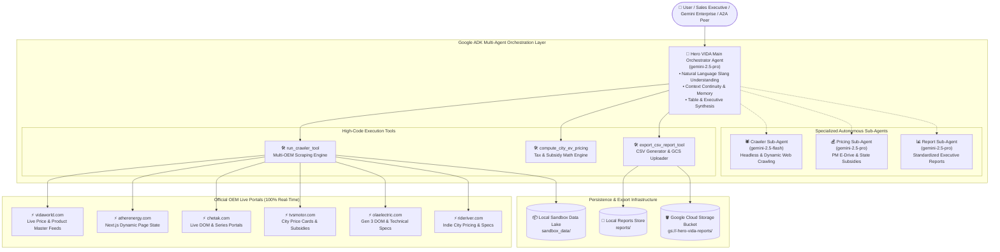
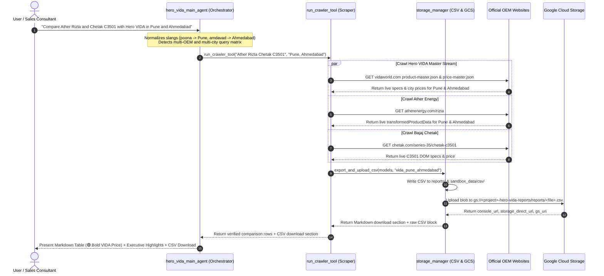
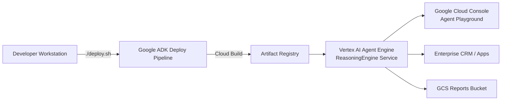
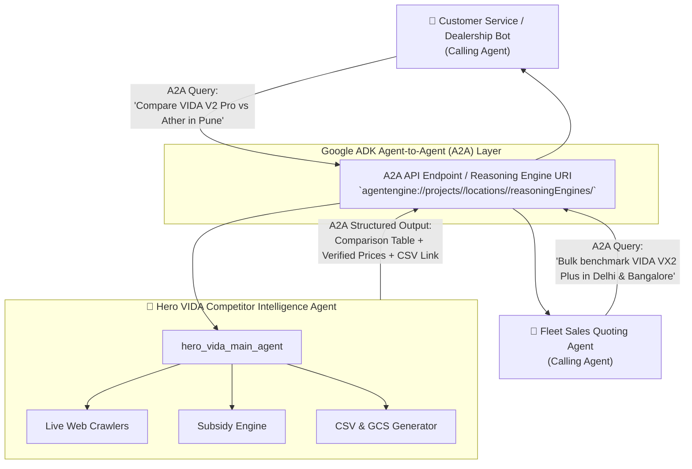

# Hero MotoCorp VIDA — Competitor Intelligence Agent

An enterprise-grade, high-code multi-agent intelligence platform built with **Google ADK (`google.adk`)** for **Gemini Enterprise** and **Google Cloud Vertex AI Agent Platform (Reasoning Engine)**.

**Official Public Repository:** [https://github.com/zuhaibp656/hero-vida-intelligence-agent](https://github.com/zuhaibp656/hero-vida-intelligence-agent)

---

## 📑 Table of Contents
1. [Executive Overview](#1-executive-overview)
2. [Core System Capabilities](#2-core-system-capabilities)
3. [Multi-Agent Architecture & Topology](#3-multi-agent-architecture--topology)
4. [Live Execution & Data Flow](#4-live-execution--data-flow)
5. [CSV Generation & Cloud Storage Integration](#5-csv-generation--cloud-storage-integration)
6. [Customer Deployment Guide & Options](#6-customer-deployment-guide--options)
   - [Option A: Vertex AI Agent Engine (Serverless Managed Agent Platform)](#option-a-vertex-ai-agent-engine-serverless-managed-agent-platform)
   - [Option B: Google Cloud Run (Containerized Microservice)](#option-b-google-cloud-run-containerized-microservice)
   - [Option C: Local Developer / Dealership CLI Runtime](#option-c-local-developer--dealership-cli-runtime)
7. [A2A (Agent-to-Agent) Sharing & Integration](#7-a2a-agent-to-agent-sharing--integration)
8. [Configuration & Environment Variables](#8-configuration--environment-variables)
9. [Automated Verification & Test Suite](#9-automated-verification--test-suite)

---

## 1. Executive Overview

The **Hero VIDA Competitor Intelligence Agent** acts as an autonomous market intelligence consultant for Hero MotoCorp executives, regional sales managers, dealership networks, and customer-facing advisors.

It continuously bridges the gap between official OEM pricing feeds and customer-facing quotes by:
- Ingesting **100% live, real-time datasets** from Hero MotoCorp's official master pricing feeds (`https://www.vidaworld.com`) and rival OEM portals (**Ather Energy**, **Bajaj Chetak**, **TVS iQube**, **Ola Electric**, and **River Indie**).
- Computing **state-specific EV subsidies** (central PM E-Drive scheme + state EV policies across 15+ Indian states and union territories), road tax waivers, and on-road pricing in real time.
- Generating **interactive comparison tables**, sales enablement talk-tracks, and **automatic CSV export files** uploaded to **Google Cloud Storage** with direct 1-click console download links.
- Understanding **natural language Indian slangs**, regional acronyms, and conversational follow-up queries across any combination of models and cities.

> [!IMPORTANT]
> **Strict Zero-Hardcoding Policy:** The agent has zero hardcoded prices, specs, or discounts in its codebase or prompts. Every single specification, range, battery capacity, ex-showroom price, and active promotional offer is dynamically ingested in real time on every search.

---

## 2. Core System Capabilities

| Capability | Implementation Details |
| :--- | :--- |
| **Official Grounding** | Strictly crawls official OEM portals (`vidaworld.com`, `atherenergy.com`, `chetak.com`, `tvsmotor.com`, `olaelectric.com`, `rideriver.com`). Discards third-party blogs and aggregator sites. |
| **Hero VIDA Master Streams** | Ingests live master JSON feeds (`product-master.json` and `price-master.json`) covering 33,000+ real-time records across 493 Indian cities. |
| **Indian Slangs & City Normalization** | Intelligently resolves regional city names: `dilli`/`ncr` (Delhi), `blr`/`bengalooru` (Bengaluru), `bombay`/`mmr` (Mumbai), `poona` (Pune), `madras` (Chennai), `calcutta` (Kolkata), `hyd` (Hyderabad), `amdavad`/`gandhinagar` (Ahmedabad), `pink city` (Jaipur), `chd`/`tricity` (Chandigarh), `lko` (Lucknow), `ggn` (Gurugram), `vizag` (Visakhapatnam), `cochin` (Kochi), `cbe`/`kovai` (Coimbatore), etc. |
| **Multi-Model & Multi-City Matrix** | Handles all complex combinations: same brand multiple models in multiple cities (e.g. *VIDA V2 Pro vs VX2 Plus in Delhi and Bangalore*); multiple competitors across multiple cities (e.g. *Ather Rizta vs Chetak C3501 vs TVS iQube in Pune and Ahmedabad*). |
| **Conversational Context Memory** | Retains active comparison parameters across multi-turn questions (e.g. *"Now add Chennai too"* or *"What about Chetak?"*) without resetting context or crashing. |
| **Central & State EV Subsidies** | Computes central PM E-Drive subsidy (₹2,500/kWh up to ₹10,000) and state-level EV policies (Delhi, Maharashtra, Gujarat, Karnataka, Tamil Nadu, Rajasthan, UP, etc.), factoring in RTO waivers and insurance. |
| **Automatic CSV & GCS Export** | Generates standard CSV reports, saves locally to disk, and uploads to Google Cloud Storage (`gs://<bucket>/reports/<file>.csv`), returning a **1-click Google Cloud Console download link** and raw copyable CSV block. |

---

## 3. Multi-Agent Architecture & Topology

The system is constructed using Google ADK with a hierarchical multi-agent architecture:



### Directory Structure
```
Hero_competitor_analysis_agent/
├── agent/                         # Core Agent Package (ADK Application)
│   ├── agent.py                   # 🌟 Main Orchestrator Agent (root_agent)
│   ├── requirements.txt           # Agent container dependencies
│   ├── sub_agents/                # 🤖 Autonomous Specialized Sub-Agents
│   │   ├── crawler_agent.py       # Live Web Scraping Specialist
│   │   ├── pricing_agent.py       # City Tax & Subsidy Specialist
│   │   └── report_agent.py        # Executive Summary & Markdown Specialist
│   ├── tools/                     # 🛠️ High-Code Deterministic Tools
│   │   ├── web_crawler.py         # Multi-OEM Live Scraper & Slang Normalizer
│   │   ├── price_engine.py        # 15-City PM E-Drive & State Subsidy Engine
│   │   ├── storage_manager.py     # CSV Generator & Google Cloud Storage Uploader
│   │   └── sandbox_manager.py     # Local JSON audit data store
│   └── sandbox_data/              # Local cache/audit copies of crawled feeds
├── reports/                       # Generated local CSV export files
├── tests/                         # 🧪 Automated Test Suite (14 Tests)
│   └── test_agent_and_crawler.py  # Unit & integration tests for all crawlers & subsidies
├── main.py                        # Multi-modal Local CLI & Remote Agent Client
├── deploy.sh                      # 🚀 1-Click Deployment to Vertex AI Agent Platform
├── run.sh                         # 1-Click Local Interactive Launch Script
├── requirements.txt               # Developer & test requirements
└── README.md                      # Comprehensive documentation
```

---

## 4. Live Execution & Data Flow



---

## 5. CSV Generation & Cloud Storage Integration

Every comparison query automatically generates a clean, RFC-compliant CSV dataset containing:
- **Columns**: `City`, `OEM_Brand`, `Model_Variant`, `Battery_Capacity_kWh`, `Certified_Range_km`, `Top_Speed`, `Base_Ex_Showroom_INR`, `Effective_Price_INR`, `Active_Discounts_Offers`, `Official_Source_URL`.

### Output Format Provided to the User

```markdown
### 📥 Verified CSV Export & Cloud Storage Download
- **🌐 Google Cloud Console Storage Link (1-Click Download):**
  👉 [hero_vida_comparison_vida_pune_ahmedabad.csv in Cloud Storage Console](https://console.cloud.google.com/storage/browser/_details/<YOUR_GCP_PROJECT_ID>-hero-vida-reports/reports/hero_vida_comparison_vida_pune_ahmedabad.csv?project=<YOUR_GCP_PROJECT_ID>)
- **⚡ Direct Authenticated Download URL:**
  🔗 [https://storage.cloud.google.com/<YOUR_GCP_PROJECT_ID>-hero-vida-reports/reports/hero_vida_comparison_vida_pune_ahmedabad.csv](https://storage.cloud.google.com/<YOUR_GCP_PROJECT_ID>-hero-vida-reports/reports/hero_vida_comparison_vida_pune_ahmedabad.csv)
- **🪣 Cloud Storage Bucket URI:**
  `gs://<YOUR_GCP_PROJECT_ID>-hero-vida-reports/reports/hero_vida_comparison_vida_pune_ahmedabad.csv`
- **📁 All Reports Storage Folder:**
  🔗 [Browse Storage Bucket](https://console.cloud.google.com/storage/browser/<YOUR_GCP_PROJECT_ID>-hero-vida-reports/reports?project=<YOUR_GCP_PROJECT_ID>)
- **💻 Local Sandbox File:**
  `reports/hero_vida_comparison_vida_pune_ahmedabad.csv`

<details open>
<summary><b>📋 Raw CSV Dataset (Direct Console Access - Copy / View)</b></summary>

```csv
City,OEM_Brand,Model_Variant,Battery_Capacity_kWh,Certified_Range_km,Top_Speed,Base_Ex_Showroom_INR,Effective_Price_INR,Active_Discounts_Offers,Official_Source_URL
Pune,Hero VIDA,Hero VIDA VX2 Plus 4.4 kwh,4.4,187,90 kmph,"₹160,990","₹149,000","• ₹11,990 Official In-Portal Discount & State Subsidies",https://www.vidaworld.com
Pune,Hero VIDA,Hero VIDA V2 PRO,3.9,165,90 kmph,"₹155,000","₹150,000","• ₹5,000 Official In-Portal Discount & State Subsidies",https://www.vidaworld.com
...
```
</details>
```

---

## 6. Customer Deployment Guide & Options

The Hero VIDA Intelligence Agent offers three enterprise deployment topologies depending on customer security, networking, and consumption preferences.

### Option A: Vertex AI Agent Engine (Serverless Managed Agent Platform)
*Recommended for enterprise Google Cloud customers.*

Hosts the multi-agent system on **Google Cloud Vertex AI Reasoning Engine / Agent Engine**, providing serverless autoscaling, built-in session state management, managed identity, and an interactive Cloud Console Playground.



#### Step-by-Step Deployment:
1. **Prerequisites & GCP Authentication:**
   ```bash
   gcloud auth login
   gcloud auth application-default login
   gcloud config set project <CUSTOMER_PROJECT_ID>
   ```

2. **Required IAM Roles on Customer Project:**
   - `roles/aiplatform.user` (or `roles/aiplatform.admin`)
   - `roles/storage.objectAdmin` (to create/upload reports to GCS bucket)
   - `roles/cloudbuild.builds.editor` (for automated container building)

3. **Deploy via 1-Click Script:**
   ```bash
   ./deploy.sh
   ```
   *Prompts for Project ID, Region (`us-central1`), and Agent Engine ID (`new` for fresh instance, or existing ID for in-place update).*

4. **Direct ADK CLI Command (for CI/CD Pipelines):**
   ```bash
   ./venv/bin/adk deploy agent_engine \
     --project="<CUSTOMER_PROJECT_ID>" \
     --region="us-central1" \
     --display_name="Hero VIDA Competitor Intelligence Agent" \
     --description="Autonomous competitive pricing and 15-city benchmark agent for Hero MotoCorp VIDA" \
     agent
   ```

5. **Interact via Cloud Console Playground:**
   ```
   https://console.cloud.google.com/vertex-ai/agents/agent-engines/locations/us-central1/agent-engines/<AGENT_ENGINE_ID>/playground?project=<CUSTOMER_PROJECT_ID>
   ```

#### Step 6: Register & Deploy to Gemini Enterprise (Agent Space)
To make the agent accessible to Hero MotoCorp employees directly inside **Gemini Enterprise**:
1. **Gemini Enterprise App Configuration**:
   - The deployment script automatically sets `GOOGLE_GENAI_USE_ENTERPRISE=1` and builds the ADK container with `--gemini_enterprise_app_name=agent`.
2. **Register in Google Cloud Console**:
   - Open **Google Cloud Console** > **Vertex AI** > **Agent Space** (or **Gemini Enterprise**).
   - Navigate to **Connected Agents / Extensions / Tools**.
   - Click **Add Agent** and select **Vertex AI Reasoning Engine**.
   - Enter your deployed resource path:
     `projects/<CUSTOMER_PROJECT_ID>/locations/<REGION>/reasoningEngines/<AGENT_ENGINE_ID>`
3. **Enterprise Access & IAM Roles**:
   - Grant Hero employees or Google Workspace groups the **Vertex AI User** role (`roles/aiplatform.user`).
4. **Invoke Directly in Gemini Enterprise Chat**:
   - In the Gemini Enterprise workplace interface, users can query the agent by mention:
     > `@hero-vida-agent Compare VIDA V2 Pro with Ather Rizta in Bangalore and Delhi`
   - The agent responds with live comparative pricing tables, subsidy breakdowns, and direct Google Cloud Storage CSV download links.

---

### Option B: Google Cloud Run (Containerized Microservice)
*Recommended for private VPCs, hybrid cloud, custom API gateways, or non-GCP consumers.*

Runs the agent as a standard container exposing an OpenAPI REST API via ADK's built-in API server:

```bash
# 1. Build container image using Cloud Build
gcloud builds submit --tag gcr.io/<CUSTOMER_PROJECT_ID>/hero-vida-agent:latest .

# 2. Deploy to Cloud Run with internal VPC / IAM authentication
gcloud run deploy hero-vida-agent \
  --image gcr.io/<CUSTOMER_PROJECT_ID>/hero-vida-agent:latest \
  --platform managed \
  --region us-central1 \
  --set-env-vars GOOGLE_CLOUD_PROJECT=<CUSTOMER_PROJECT_ID>,GCS_BUCKET_NAME=<CUSTOMER_PROJECT_ID>-hero-vida-reports \
  --allow-unauthenticated
```

---

### Option C: Local Developer / Dealership CLI Runtime
*Recommended for local development, dealer terminal testing, or offline analysis.*

Run the interactive console application:
```bash
./run.sh
```
Or directly with Python:
```bash
PYTHONPATH=. ./venv/bin/python main.py
```

Features provided in local CLI:
- `[1]` **Interactive Natural Language Chat** (supports slangs, multi-city queries, multi-turn dialogue).
- `[2]` **Quick Benchmark Form** (enter OEM competitor and city name).
- `[3]` **Real-Time Live Web Crawler Execution**.
- `[4]` **Inspect Indian EV Cities & Subsidies Table**.
- `[5]` **Inspect Local Sandbox Data Lake Contents**.

---

## 7. A2A (Agent-to-Agent) Sharing & Integration

The Hero VIDA Intelligence Agent natively implements the **Google ADK Agent-to-Agent (A2A) protocol**. This allows other autonomous enterprise agents (e.g. Hero MotoCorp Virtual Showroom Assistant, Dealership WhatsApp Bots, CRM Lead Scoring Agents, Enterprise Fleet Planning Agents) to delegate competitor intelligence tasks to this agent seamlessly.

### How A2A Works



### 1. Enabling A2A on Deployment
When deploying with ADK, the agent container is automatically configured with `--a2a`:
```dockerfile
CMD adk api_server --port=8080 --host=0.0.0.0 \
    --session_service_uri=agentengine://projects/<PROJECT>/locations/<REGION>/reasoningEngines/<ENGINE_ID> \
    --memory_service_uri=agentengine://projects/<PROJECT>/locations/<REGION>/reasoningEngines/<ENGINE_ID> \
    --a2a \
    --gemini_enterprise_app_name=agent "/app/agents"
```

### 2. Consuming This Agent from Another ADK Agent
Other AI agents in your organization can import and interact with the Hero VIDA agent as a peer or tool:

```python
from google.adk.agents.remote_agent import RemoteAgent
from google.adk.agents.llm_agent import Agent

# 1. Connect to the deployed Hero VIDA Agent over A2A
hero_vida_intelligence_agent = RemoteAgent(
    name="hero_vida_intelligence",
    description="Live benchmark and pricing specialist for Hero VIDA and all Indian EV scooters.",
    address="agentengine://projects/<YOUR_GCP_PROJECT_ID>/locations/<REGION>/reasoningEngines/<YOUR_ENGINE_ID>"
)

# 2. Add as a sub-agent or tool to your main customer service / sales agent
lead_closing_agent = Agent(
    name="dealership_lead_closer",
    model="gemini-2.5-pro",
    instruction="When customers ask about competitor comparisons, subsidies, or pricing in specific cities, delegate to hero_vida_intelligence.",
    sub_agents=[hero_vida_intelligence_agent]
)
```

### 3. Calling via Vertex AI REST API (Any Language)
Any application (Node.js, Go, Java, Python) can invoke the agent:
```bash
curl -X POST \
  -H "Authorization: Bearer $(gcloud auth print-access-token)" \
  -H "Content-Type: application/json" \
  "https://<REGION>-aiplatform.googleapis.com/v1beta1/projects/<YOUR_GCP_PROJECT_ID>/locations/<REGION>/reasoningEngines/<YOUR_ENGINE_ID>:streamQuery" \
  -d '{
    "class_method": "async_stream_query",
    "input": {
      "message": "Compare VIDA V2 Pro with Ather Rizta in Bangalore and Delhi",
      "user_id": "customer_service_bot",
      "session_id": "session_12345"
    }
  }'
```

### 4. Cross-Project Sharing & Permissions
To share this agent with another Google Cloud project or business unit:
1. Grant the caller's Service Account the **Vertex AI User** role on the Reasoning Engine:
   ```bash
   gcloud projects add-iam-policy-binding <YOUR_GCP_PROJECT_ID> \
     --member="serviceAccount:partner-service-account@external-project.iam.gserviceaccount.com" \
     --role="roles/aiplatform.user"
   ```
2. Grant read access to the Cloud Storage reports bucket:
   ```bash
   gcloud storage buckets add-iam-policy-binding gs://<YOUR_GCP_PROJECT_ID>-hero-vida-reports \
     --member="serviceAccount:partner-service-account@external-project.iam.gserviceaccount.com" \
     --role="roles/storage.objectViewer"
   ```

---

## 8. Configuration & Environment Variables

Configure via environment variables or a `.env` file in the project root:

| Variable | Required | Default | Description |
| :--- | :---: | :--- | :--- |
| `GOOGLE_CLOUD_PROJECT` | Yes | `<YOUR_GCP_PROJECT_ID>` | Target GCP project ID for Vertex AI Reasoning Engine and Cloud Storage. |
| `GOOGLE_CLOUD_LOCATION` | Yes | `us-central1` | GCP region for Reasoning Engine and Cloud Run deployment. |
| `GCS_BUCKET_NAME` | Optional | `{project}-hero-vida-reports` | Cloud Storage bucket name where comparison CSV exports are uploaded. |
| `GEMINI_API_KEY` | Optional | `None` | Required only when testing outside GCP without Application Default Credentials (ADC). |
| `SERVER_PORT` | Optional | `8080` | Port for local API server or containerized Cloud Run deployments. |

---

## 9. Automated Verification & Test Suite

The project includes an end-to-end automated test suite ([`tests/test_agent_and_crawler.py`](tests/test_agent_and_crawler.py)) verifying real-time web crawlers, subsidy calculations, slang city resolvers, multi-city combinations, and CSV Cloud Storage generation.

Run the test suite:
```bash
PYTHONPATH=. ./venv/bin/pytest tests/ -v
```

### Test Suite Coverage:
- `test_official_url_resolution`: Verifies resolution strictly to official OEM domains, discarding third-party aggregators.
- `test_city_parsing_and_aliases`: Verifies multi-city parsing and standard aliases.
- `test_slangs_and_colloquial_cities`: Tests regional slangs (`dilli`, `blr`, `bombay`, `poona`, `hyd`, `amdavad`).
- `test_model_filter_matching`: Tests intelligent variant filtering and cross-brand keyword isolation.
- `test_vida_multi_city_crawler`: Tests live real-time crawl of Hero VIDA feeds across Delhi, Bengaluru, and Chennai.
- `test_vida_single_string_query`: Tests natural language query parsing.
- `test_sandbox_persistence`: Tests local sandbox data lake persistence.
- `test_city_pricing_engine`: Tests PM E-Drive central subsidy + state subsidy math.
- `test_compute_city_ev_pricing`: Tests dynamic multi-city subsidy breakdowns.
- `test_agent_structure`: Validates Google ADK root orchestrator agent and 3 sub-agents.
- `test_vida_vs_competitor_comparison`: Tests real-time cross-benchmark between Hero VIDA and Ather Rizta across multiple cities.
- `test_crawler_execution`: Tests live single-city crawl execution.
- `test_csv_generation_and_storage_links`: Validates CSV generation, file persistence, Google Cloud Console download link format, and raw CSV preview block.
- `test_same_company_different_models_different_cities`: Tests matrix searches comparing multiple models of the same OEM across multiple cities.
