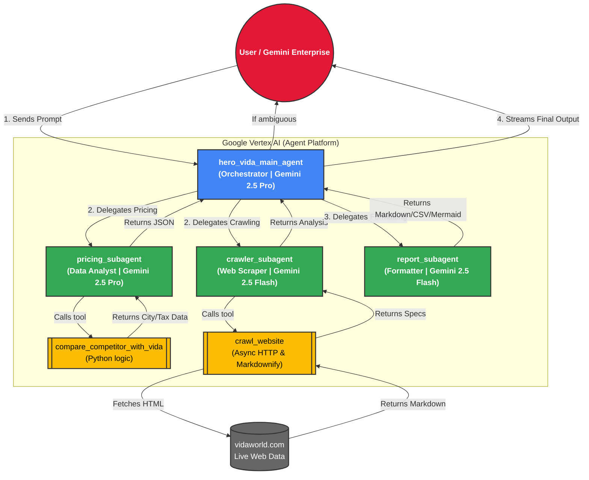

# Hero MotoCorp VIDA — Competitor Intelligence Agent

A clean, high-code multi-agent system built entirely with **Google ADK (`google.adk`)** for **Gemini Enterprise (GE)** and **Vertex AI Agent Studio**.

---

## 1. Zero-Code Dynamic Benchmarking

* **Dynamic Competitor Variable**: Ask about any brand (e.g. `Ather`, `Chetak`, `TVS iQube`, `Ola`, `River Indie`, `Simple One`, etc.).
* **Dynamic City Variable**: Ask about any Indian city (e.g. `Bengaluru`, `Delhi`, `Pune`, `Mumbai`, `Ahmedabad`, `Jaipur`, etc.).
* **Baseline**: The agent **ALWAYS benchmarks competitors against Hero MotoCorp's VIDA** in that city.

---

## 2. Multi-Agent Architecture (Google ADK)

```
Hero_competitor_analysis_agent/
├── agent/                         # Main Agent and Sub-Agents
│   ├── agent.py                   # 🌟 MAIN ORCHESTRATOR AGENT (root_agent)
│   ├── sub_agents/                # 🤖 3 SPECIALIZED SUB-AGENTS
│   │   ├── crawler_agent.py       # Sub-Agent 1: Crawls official portal (vidaworld.com)
│   │   ├── pricing_agent.py       # Sub-Agent 2: Calculates city EV prices & subsidies
│   │   └── report_agent.py        # Sub-Agent 3: Formats comparison tables & value scores
│   └── tools/                     # 🛠️ PYTHON TOOLS
│       ├── web_crawler.py         # Python crawler script (converts HTML to clean Markdown)
│       └── price_engine.py        # Dynamic EV price & subsidy calculation engine
├── main.py                        # Interactive runner (Natural Chat & Variable Inputs)
├── deploy.sh                      # 🚀 1-Click Deploy to Gemini Enterprise / Agent Studio
├── run.sh                         # 1-Click Local Launch script
├── requirements.txt               # Dependencies
└── README.md                      # Documentation
```

---

## 3. Deploying to Your Argolis GCP Project & Gemini Enterprise

### Method 1: Using the 1-Click Deployment Script
```bash
cd /Users/zuhaibp/Documents/Argolis/Hero_competitor_analysis_agent
./deploy.sh
```
The script prompts for your **Argolis GCP Project ID** and **Region** (e.g. `us-central1`), and deploys the agent using Google ADK.

---

### Method 2: Manual ADK CLI Deployment
```bash
cd /Users/zuhaibp/Documents/Argolis/Hero_competitor_analysis_agent

./venv/bin/adk deploy agent_engine \
  --project="<YOUR_ARGOLIS_PROJECT_ID>" \
  --region="us-central1" \
  --display_name="Hero VIDA Competitor Intelligence Agent" \
  --description="Autonomous competitive pricing and 15-city benchmark agent for Hero MotoCorp VIDA" \
  agent
```

---

## 4. How It Appears in Gemini Enterprise & Agent Studio

Once deployed:
1. **Vertex AI / Agent Studio**:
   * Go to **Google Cloud Console > Vertex AI > Reasoning Engines / Agent Studio**.
   * You will see `Hero VIDA Competitor Intelligence Agent` with its exposed sub-agents and tools (`compare_competitor_with_vida`, `run_crawler_tool`).
2. **Gemini Enterprise (GE) Chat**:
   * In Gemini Enterprise under **Agents / Extensions**, toggle **Hero VIDA Competitor Intelligence Agent** to **Enabled**.
   * Users in your organization can now open Gemini Enterprise chat and ask:
     > *"Compare Ather in Bengaluru with VIDA"*  
     > *"How does Bajaj Chetak compare with Hero VIDA in Pune?"*  
     > *"Show me 15-city competitive pricing for Hero VIDA"*

---

## 5. Local Testing Before Deployment

```bash
./run.sh
```
Select **Option 1** for Natural Language Chat or **Option 2** for Variable Input Prompts.

---

## 6. Architecture Topology


