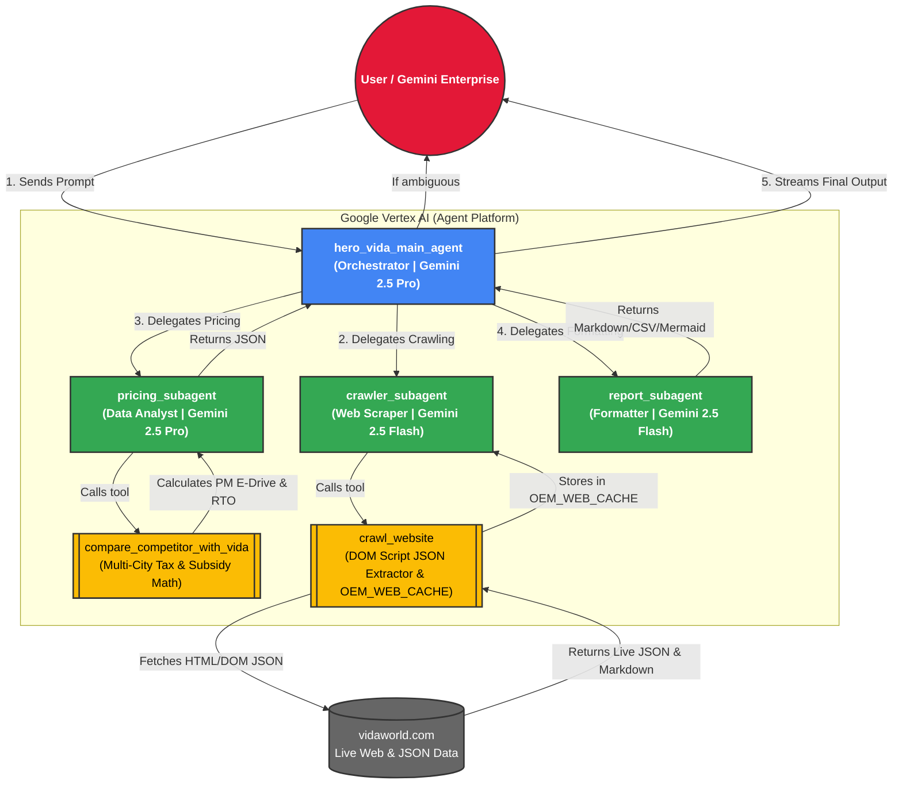

# Hero MotoCorp VIDA — Competitor Intelligence Agent

A clean, high-code multi-agent system built entirely with **Google ADK (`google.adk`)** for **Gemini Enterprise (GE)** and **Vertex AI Agent Studio**.

---

## 1. Real-Time Crawl-Driven Architecture & Zero Hardcoding

* **Zero Hardcoded Model Prices:** No static model price arrays in Python code. All vehicle prices, battery kWh specs, IDC ranges, and active promotional offers are fetched via **live real-time web crawling**.
* **DOM Script & Embedded JSON Extraction (`__NEXT_DATA__`):** Modern Single-Page Applications (Next.js/React/Vue) embed their full data dictionary—including all vehicle models, city dropdown price matrices, and tab options—inside DOM `<script id="__NEXT_DATA__" type="application/json">` tags. The crawler inspects these DOM script tags to extract 100% of structured model & city pricing data in a single fetch.
* **In-Memory Web Cache (`OEM_WEB_CACHE`):** Crawled web pages and extracted JSON datasets are cached in memory with a 1-hour TTL. Recurring queries for the same site or models serve instantly from memory with **0ms latency**.
* **Dynamic Official OEM Domain Discovery:** Automatically discovers official competitor websites (`https://www.[brand].com`), filtering out 3rd party aggregators (BikeWale, Zigwheels, etc.).
* **Multi-City & All-Models Benchmarking:** Supports queries across multiple cities simultaneously (e.g., *"Compare all Hero VIDA models in Bengaluru and Pune"*).

---

## 2. Multi-Agent Architecture (Google ADK)

```
Hero_competitor_analysis_agent/
├── agent/                         # Main Agent and Sub-Agents
│   ├── agent.py                   # 🌟 MAIN ORCHESTRATOR AGENT (root_agent)
│   ├── sub_agents/                # 🤖 3 SPECIALIZED SUB-AGENTS
│   │   ├── crawler_agent.py       # Sub-Agent 1: Real-Time Web Crawling (vidaworld.com)
│   │   ├── pricing_agent.py       # Sub-Agent 2: Multi-City Tax & Subsidy Calculator
│   │   └── report_agent.py        # Sub-Agent 3: Formats Standardized Vertical Tables
│   └── tools/                     # 🛠️ PYTHON TOOLS
│       ├── web_crawler.py         # Real-time web crawler with DOM Script JSON Extraction & OEM_WEB_CACHE
│       └── price_engine.py        # Dynamic EV tax, PM E-Drive subsidy & RTO calculation engine
├── main.py                        # Interactive runner (Natural Chat & Variable Inputs)
├── deploy.sh                      # 🚀 1-Click Deploy to Gemini Enterprise / Agent Studio
├── run.sh                         # 1-Click Local Launch script
├── requirements.txt               # Dependencies
└── README.md                      # Documentation
```

---

## 3. Deploying to Your Argolis GCP Project & Gemini Enterprise

### Method 1: Using the 1-Click Deployment Script
```bash
cd /Users/zuhaibp/Documents/Argolis/Hero_competitor_analysis_agent
./deploy.sh
```
The script prompts for your **Argolis GCP Project ID** and **Region** (e.g. `us-central1`), and deploys the agent using Google ADK.

---

### Method 2: Manual ADK CLI Deployment
```bash
cd /Users/zuhaibp/Documents/Argolis/Hero_competitor_analysis_agent

./venv/bin/adk deploy agent_engine \
  --project="<YOUR_ARGOLIS_PROJECT_ID>" \
  --region="us-central1" \
  --display_name="Hero VIDA Competitor Intelligence Agent" \
  --description="Autonomous real-time web-crawling competitive pricing, subsidy engine, and active offer benchmark agent for Hero MotoCorp VIDA" \
  agent
```

---

## 4. How It Appears in Gemini Enterprise & Agent Studio

Once deployed:
1. **Vertex AI / Agent Studio**:
   * Go to **Google Cloud Console > Vertex AI > Reasoning Engines / Agent Studio**.
   * You will see `Hero VIDA Competitor Intelligence Agent` with its exposed sub-agents and tools (`compare_competitor_with_vida`, `run_crawler_tool`).
2. **Gemini Enterprise (GE) Chat**:
   * In Gemini Enterprise under **Agents / Extensions**, toggle **Hero VIDA Competitor Intelligence Agent** to **Enabled**.
   * Users in your organization can now open Gemini Enterprise chat and ask:
     > *"Compare all Hero VIDA models pricing across Bengaluru and Pune"*  
     > *"Compare Ather in Bengaluru with VIDA"*  
     > *"Show me state subsidies for Hero VIDA in Delhi and Mumbai"*

---

## 5. Local Testing Before Deployment

```bash
./run.sh
```
Select **Option 1** for Natural Language Chat or **Option 2** for Variable Input Prompts.

---

## 6. Architecture Topology



