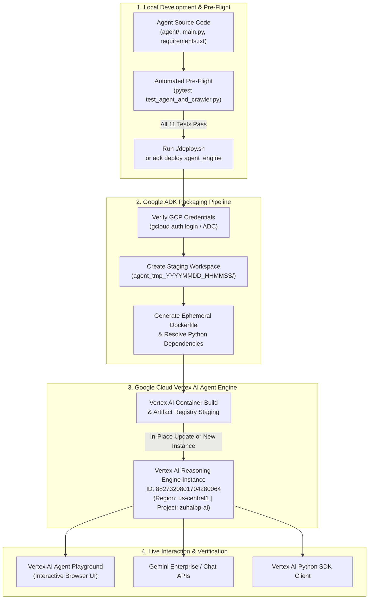
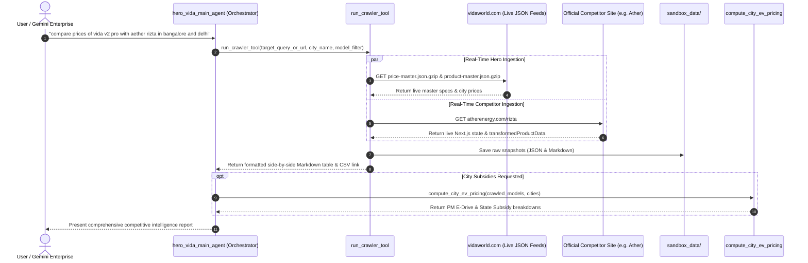

# Hero MotoCorp VIDA — Competitor Intelligence Agent

An enterprise-grade, high-code multi-agent system built with **Google ADK (`google.adk`)** for **Gemini Enterprise** and **Vertex AI Agent Engine (Reasoning Engine)**.

---

## 1. 100% Real-Time Architecture (Zero Cache, Zero Hardcoding)

* **Strict Real-Time Data Ingestion:** Every query executes live HTTP requests directly against official OEM portals. No static price tables, no mock discount dictionaries, and **zero in-memory caching**.
* **Hero VIDA Official Master Stream:** Directly pulls from Hero MotoCorp's live master endpoints ([`price-master.json.gzip`](https://www.vidaworld.com/content/dam/vida/config/price-master.json.gzip) & [`product-master.json.gzip`](https://www.vidaworld.com/content/dam/vida/config/product-master.json.gzip)) for exact city-specific Ex-Showroom pricing and active official benefits (Exchange bonuses, Corporate discounts, Festive cash).
* **Live Competitor Crawling:** Dynamically extracts competitor specifications and city-specific pricing from official OEM domains (Ather Energy, Bajaj Chetak, TVS iQube, Ola Electric) by parsing live Next.js page state (`__NEXT_DATA__`), JSON-LD structured schemas (`@type: Product`, `@type: Vehicle`), and rendered DOM elements in real time.
* **Strict Official Domain Grounding:** Strictly limits searches to verified OEM portals (`vidaworld.com`, `atherenergy.com`, `chetak.com`, `tvsmotor.com`, `olaelectric.com`), strictly discarding 3rd-party aggregators, blogs, and review sites.
* **Sandbox Data Lake (`sandbox_data/`):** All scraped raw payloads and structured models are archived in the local sandbox for auditability and sub-agent retrieval.

---

## 2. Multi-Agent Topology (Google ADK)

```
Hero_competitor_analysis_agent/
├── agent/                         # Main Agent and Sub-Agents
│   ├── agent.py                   # 🌟 MAIN ORCHESTRATOR AGENT (root_agent)
│   ├── sub_agents/                # 🤖 3 SPECIALIZED SUB-AGENTS
│   │   ├── crawler_agent.py       # Sub-Agent 1: Real-Time Live OEM Web Crawler
│   │   ├── pricing_agent.py       # Sub-Agent 2: 15-City PM E-Drive & State Subsidy Calculator
│   │   └── report_agent.py        # Sub-Agent 3: Formats Executive Tables & Visual Badges
│   ├── tools/                     # 🛠️ TOOLS & ENGINES
│   │   ├── web_crawler.py         # Live Web Scraper, City Resolver & Comparison Engine
│   │   ├── price_engine.py        # PM E-Drive (₹2,500/kWh) & State Subsidy / RTO Calculator
│   │   └── sandbox_manager.py     # Sandbox Data Lake persistence (JSON & DOM markdown)
├── sandbox_data/                  # 📦 Local Sandbox Data Lake
├── tests/                         # 🧪 Automated Test Suite
│   └── test_agent_and_crawler.py  # 11 Unit & Integration tests for Crawler, Sandbox, and Subsidies
├── main.py                        # Interactive Local CLI (Chat, Variable Form, Crawler, Sandbox)
├── deploy.sh                      # 🚀 1-Click Deploy / In-Place Update script for Vertex AI
├── run.sh                         # 1-Click Local Launch script
├── requirements.txt               # Dependencies
└── README.md                      # Documentation
```

---

## 3. End-to-End Deployment Process

Deploying the Hero VIDA agent to Google Cloud Vertex AI Agent Engine (Reasoning Engine) packages your local Python agent code, creates a managed container runtime, and hosts the multi-agent system on Vertex AI.

### Deployment Architecture & Flow Diagram



---

### Step-by-Step Deployment Instructions

#### Step 1: Authenticate with Google Cloud
Ensure your local environment is authenticated with your GCP project:
```bash
# Log in to Google Cloud SDK
gcloud auth login

# Set application default credentials
gcloud auth application-default login

# Configure target project ID
gcloud config set project zuhaibp-ai
```

#### Step 2: Run Local Pre-Flight Tests
Always verify that the real-time crawler, subsidy calculation engine, and agent structure pass all unit and integration tests:
```bash
PYTHONPATH=. ./venv/bin/pytest
```
*Expected: `11 passed`.*

#### Step 3: Execute the 1-Click Deployment Script
Run the automated deployment script from the project root:
```bash
./deploy.sh
```

During execution, the script will prompt for:
1. **GCP Project ID:** Default is `zuhaibp-ai` (press Enter to accept).
2. **GCP Region:** Default is `us-central1` (press Enter to accept).
3. **Agent Engine ID:** 
   - Press **Enter** to perform an **in-place update** on the active production instance (`8827320801704280064`).
   - Type **`new`** to spin up a completely fresh Reasoning Engine instance.

#### Step 4: What Happens Under the Hood
1. **Telemetry & Environment:** Disables interactive telemetry prompts and sets `PYTHONPATH`.
2. **Source Code Staging:** Copies your code into an isolated temporary folder (`agent_tmp_YYYYMMDD_HHMMSS/`).
3. **Containerization:** Generates an optimized `Dockerfile` pinning Python 3.11, installing `google-adk`, `playwright`, and project dependencies.
4. **Vertex AI In-Place Deployment:** Invokes the Vertex AI Reasoning Engine API:
   ```bash
   ./venv/bin/adk deploy agent_engine \
     --project="zuhaibp-ai" \
     --region="us-central1" \
     --agent_engine_id="8827320801704280064" \
     --display_name="Hero VIDA Competitor Intelligence Agent" \
     --description="Autonomous competitive pricing and 15-city benchmark agent for Hero MotoCorp VIDA" \
     agent
   ```
5. **Cleanup:** Removes the temporary staging folder once the remote build succeeds.

#### Step 5: Test in Vertex AI Agent Playground
Once deployment succeeds, open the live playground in Google Cloud Console:
```
https://console.cloud.google.com/vertex-ai/agents/agent-engines/locations/us-central1/agent-engines/8827320801704280064/playground?project=zuhaibp-ai
```

Try real-time queries:
* `compare prices of vida v2 pro with aether rizta in bangalore and delhi`
* `compare prices for vida v2 pro in Delhi banaglore and chennai`
* `what are the subsidies on vida v2 pro in mumbai and pune?`

---

## 4. Local Execution & CLI

You can also run the agent locally without deploying to GCP:
```bash
# Launch interactive CLI mode
./run.sh

# Or run via Python directly
PYTHONPATH=. ./venv/bin/python main.py
```

---

## 5. Live Agent Data Flow



